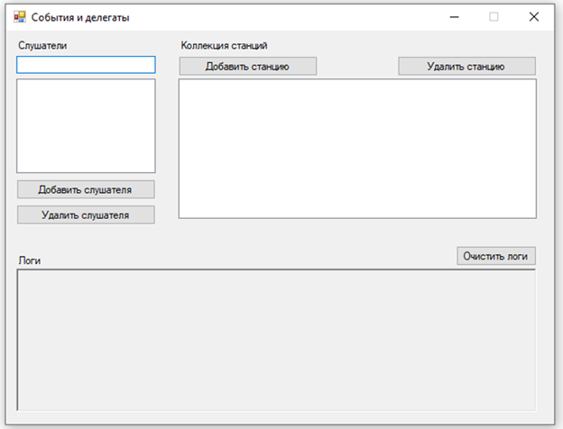
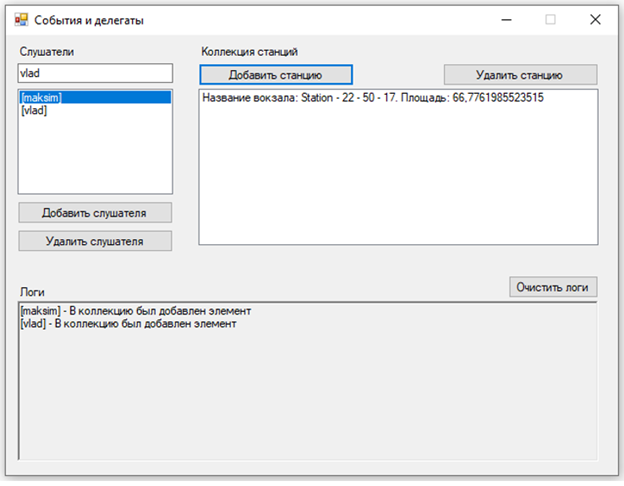
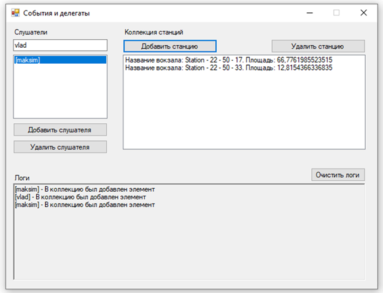
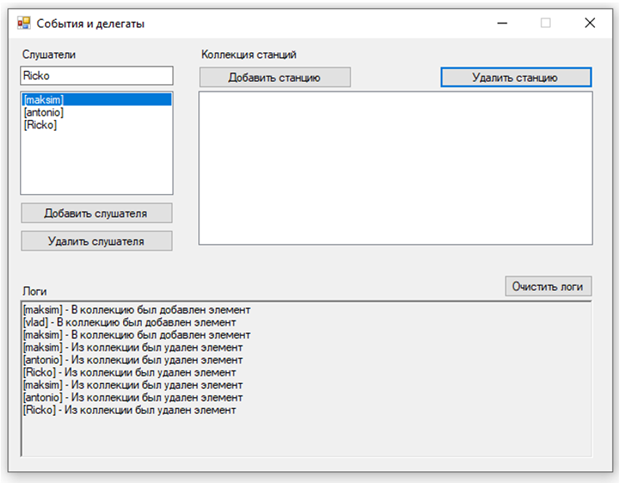
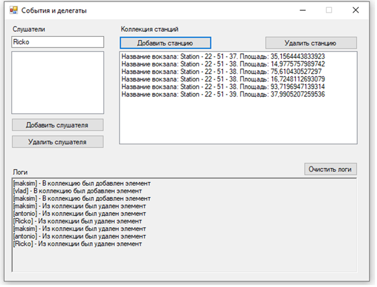

# Делегаты и события 

## Задание 
В лабораторной работе требуется определить класс, содержащий типизированную коллекцию, который с помощью событий извещает об изменениях в коллекции. Для событий, извещающих об изменениях в коллекции, определяется пользовательский тип делегат. События регистрируются в специальных классах-слушателях.  
Придерживаться предметной области предыдущих лабораторных работ (<strong>Станция для поездов</strong>). Реализовать события на добавление/удаление элементов в коллекцию. Зарегистрировать делегаты для этих событий. Привести рабочий пример делегата с использованием синтаксиса лямбда выражений.

 

## Готовая программа
### Начальное окно программы  
  

### Добавление первых слушателей  
  

### Удаление одного из слушателей  
  

### Добавление других слушателей  
  

### Удаление всех слушателей  
  
